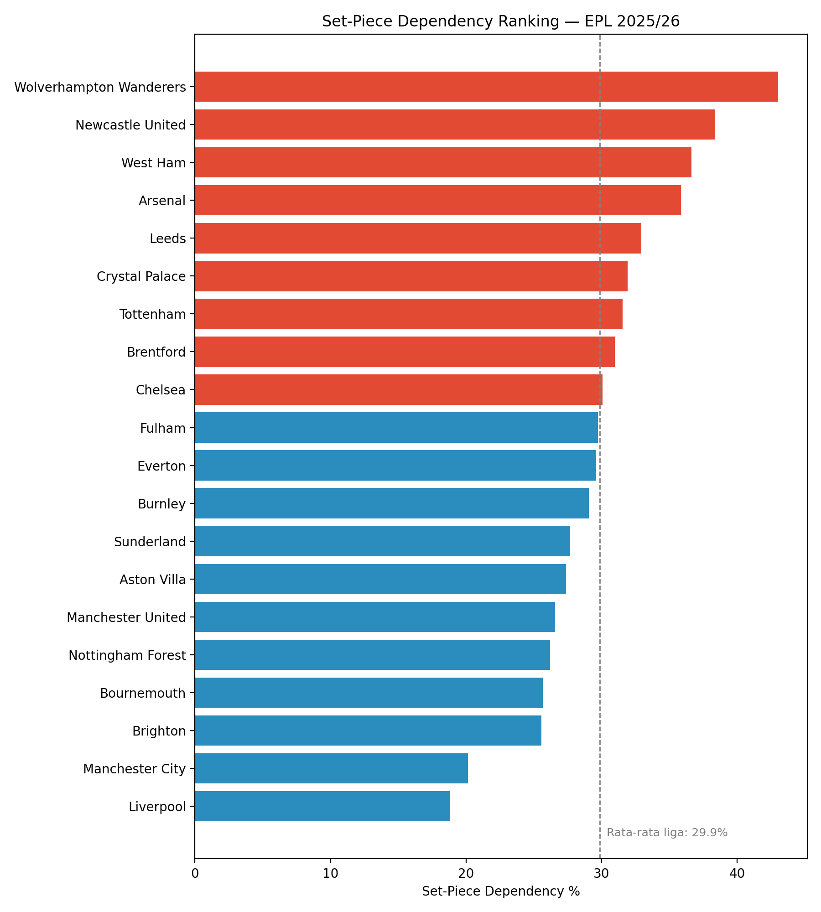
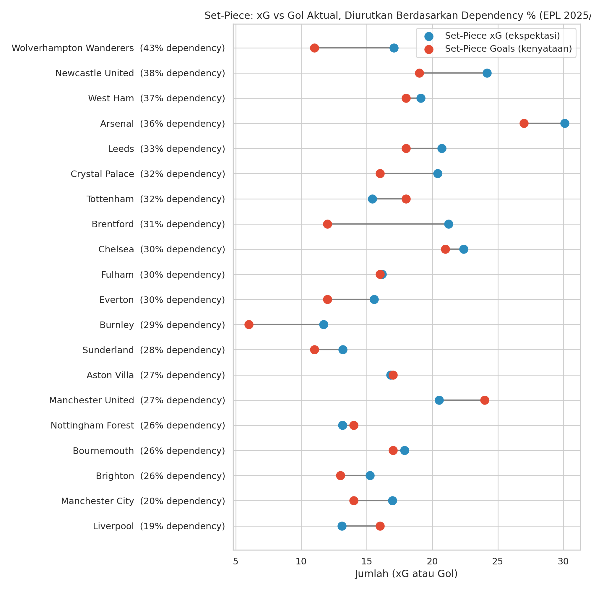
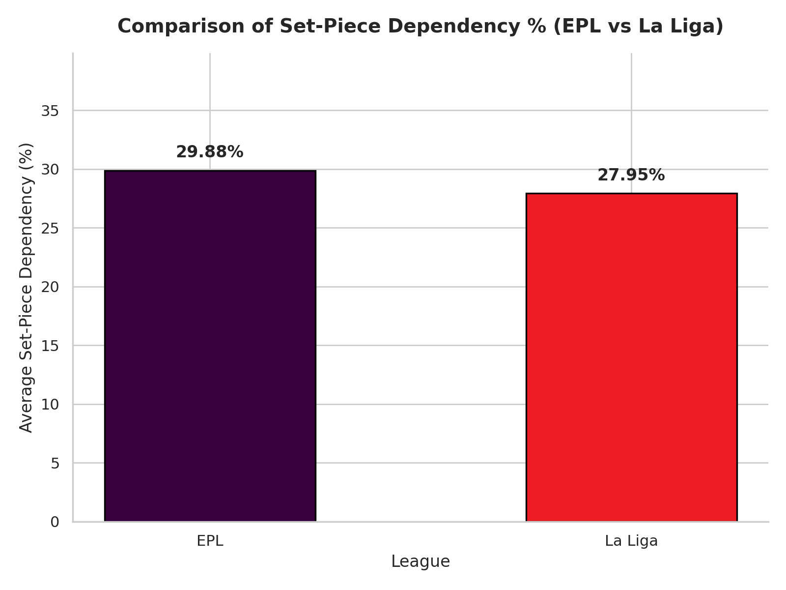

# Set-Piece Dependency & Efficiency: EPL 2025/26 xG Situation Analysis

Analisis distribusi Expected Goals (xG) tim-tim Premier League musim 2025/26 berdasarkan skema permainan (Open Play, Corner, Set Piece, Direct Free-kick, Penalty), untuk mengukur seberapa besar tim **bergantung** pada bola mati — dan seberapa **efisien** mereka mengonversi peluang itu jadi gol beneran.

## Pertanyaan yang Dijawab

1. Tim mana yang paling bergantung pada bola mati untuk menciptakan peluang (xG)?
2. Apakah ketergantungan itu berbanding lurus dengan hasil nyata di lapangan — atau ada tim yang jauh lebih (atau kurang) klinis dari yang diprediksi xG-nya?
3. Bagaimana perbandingan pola ini dengan liga top Eropa lain, dalam hal ini La Liga?

## Sumber Data & Tools

- **Data**: [Understat](https://understat.com), diakses via library [`understatapi`](https://github.com/collinb9/understatAPI)
- **Tech stack**: Python (Pandas), Matplotlib, Seaborn
- **Musim**: 2025/26 (penuh, 38 matchday) untuk EPL dan La Liga

## Metodologi Singkat

1. Scraping data situational xG per tim (20 tim EPL) via `TeamEndpoint.get_context_data()`
2. Hitung **Set-Piece Dependency %** = (xG dari Corner + Set Piece + Direct Free-kick + Penalty) ÷ total xG
3. Bandingkan dengan **gol aktual** dari situasi yang sama, untuk melihat efisiensi konversi (xG vs gol nyata)
4. Ulangi perhitungan rata-rata liga untuk La Liga sebagai pembanding

## Temuan Utama

### 1. Siapa paling bergantung bola mati?



**Wolverhampton Wanderers** adalah tim paling bergantung pada bola mati musim ini (**43.02%** dari total xG mereka), diikuti **Newcastle United** (38.33%) dan **West Ham** (36.62%). Di ujung lain, **Liverpool** (18.78%) dan **Manchester City** (20.15%) paling sedikit mengandalkan bola mati — konsisten dengan gaya main mereka yang dominan open play.

### 2. Ketergantungan tinggi ≠ efisien



Ini temuan paling menarik dari analisis ini: xG tinggi di bola mati tidak selalu berbuah gol.

- **Manchester United** paling klinis — meski dependency mereka relatif rendah (26.56%), porsi gol nyata dari bola mati mereka justru **34.78%**, jauh di atas ekspektasi xG-nya.
- **Burnley** sebaliknya — dependency mereka cukup tinggi (29.06%), tapi porsi gol nyata cuma **15.79%**, artinya banyak peluang berkualitas dari bola mati yang gagal dikonversi.
- **Wolverhampton Wanderers**, meski juara ranking dependency, ternyata sedikit underperform terhadap xG-nya sendiri di situasi bola mati.

### 3. Perbandingan dengan La Liga



Rata-rata **Set-Piece Dependency %** EPL musim 2025/26 adalah **29.88%**, sedikit lebih tinggi dibanding La Liga yang berada di **27.95%** — indikasi awal bahwa gol dari bola mati berperan sedikit lebih besar di kompetisi Inggris dibanding Spanyol musim ini.

## Cara Menjalankan Ulang

```bash
pip install understatapi pandas matplotlib seaborn
```

Buka `notebook.ipynb`, jalankan cell secara berurutan dari atas ke bawah.

## Keterbatasan

- Analisis La Liga baru sebatas perbandingan rata-rata liga, belum breakdown per tim seperti EPL
- Data bersumber dari satu musim penuh (2025/26) — belum melihat tren antar musim
